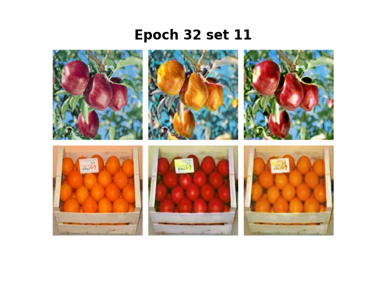
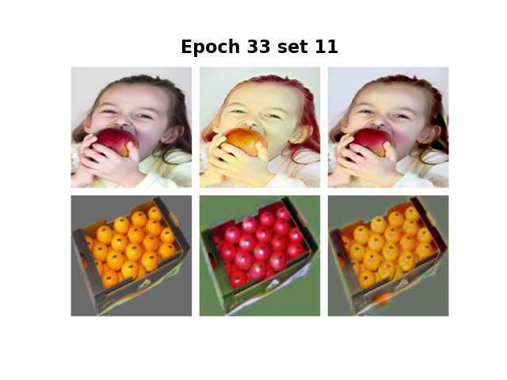
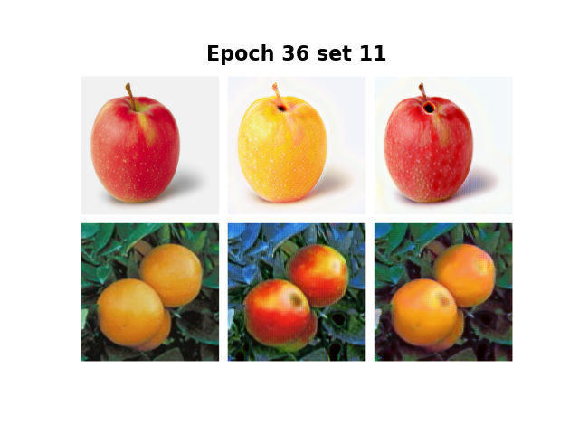
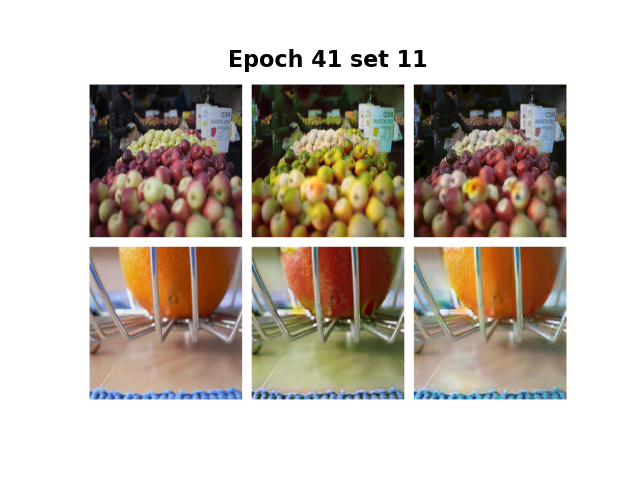

# CycleGAN for Apple-to-Orange Translation

A PyTorch implementation of CycleGAN for bidirectional object-to-object translation between apples and oranges. This model performs unpaired image translation, converting apple images to oranges and vice versa using adversarial training and cycle consistency loss.

## Theory

CycleGAN enables image-to-image translation without requiring paired training data. The model consists of two generators (G: Apple→Orange, H: Orange→Apple) and two discriminators (X: Apple discriminator, Y: Orange discriminator). The key innovation is the cycle consistency loss that ensures the translated image can be converted back to the original domain.

**Key Components:**
- **Adversarial Loss**: Ensures generated images are indistinguishable from real images
- **Cycle Consistency Loss**: Maintains content preservation during translation (Apple→Orange→Apple should equal original Apple)
- **Generator Architecture**: U-Net style with residual blocks for feature preservation
- **Discriminator Architecture**: PatchGAN for local patch classification

## Architecture

### Generator
The generator employs a U-Net-like architecture optimized for image translation:
- **Initial Convolution**: 7×7 convolution with reflection padding
- **Downsampling**: Two convolutional blocks reducing spatial dimensions while increasing channels
- **Residual Blocks**: Nine residual blocks for capturing high-level features and maintaining spatial information
- **Upsampling**: Transposed convolutions restoring original image dimensions
- **Output Layer**: Final convolution with Tanh activation producing RGB images

### Discriminator
PatchGAN discriminator architecture for realistic texture generation:
- **Multi-scale Convolutions**: Progressive feature extraction with increasing channel depth
- **Instance Normalization**: Stabilizes training and improves convergence
- **Patch Classification**: Classifies overlapping image patches as real or fake

## Sample Results

Training results showing the model's progression across different epochs:

**Epoch 32**



**Epoch 33**



**Epoch 36**



**Epoch 41**



## Code Structure

```
├── generator.py          # Generator model with residual blocks
├── discriminator.py      # PatchGAN discriminator
├── dataset.py           # Custom dataset for apple/orange images
├── trainer.py           # Training loop with adversarial and cycle losses
├── training_models.ipynb # Complete training pipeline
└── Models/              # Pre-trained model weights
```

## Implementation Details

**Training Configuration:**
- Learning Rate: 2e-4 with Adam optimizer (β1=0.5, β2=0.999)
- Cycle Lambda: 10 (weight for cycle consistency loss)
- Batch Size: 1
- Input Resolution: 256×256
- Data Augmentation: Color jittering, random horizontal flips

**Loss Functions:**
- MSE Loss for adversarial training
- L1 Loss for cycle consistency
- Mixed precision training with gradient scaling

## Quick Start

1. **Setup Environment:**
   ```bash
   pip install torch torchvision matplotlib tqdm
   ```

2. **Prepare Dataset:**
   ```
   apple_orange_data/
   ├── train/
   │   ├── apple/
   │   └── orange/
   ```

3. **Train Model:**
   ```python
   from trainer import train_models
   from generator import Generator
   from discriminator import Discriminator
   
   # Initialize models and start training
   # See training_models.ipynb for complete setup
   ```

4. **Load Pre-trained Models:**
   ```python
   generator_G = Generator(in_channels=3, out_channels=3, num_features=64, num_residuals=9)
   generator_G.load_state_dict(torch.load('Models/generator_g.pth.tar'))
   ```

## Results Format

Each training visualization shows:
- **Row 1**: Original Apple → Generated Orange → Reconstructed Apple
- **Row 2**: Original Orange → Generated Apple → Reconstructed Orange

The cycle consistency is demonstrated by comparing original images with their reconstructed versions.
